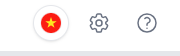
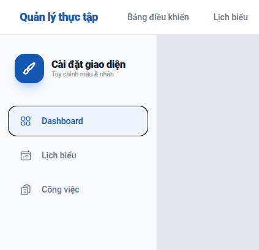
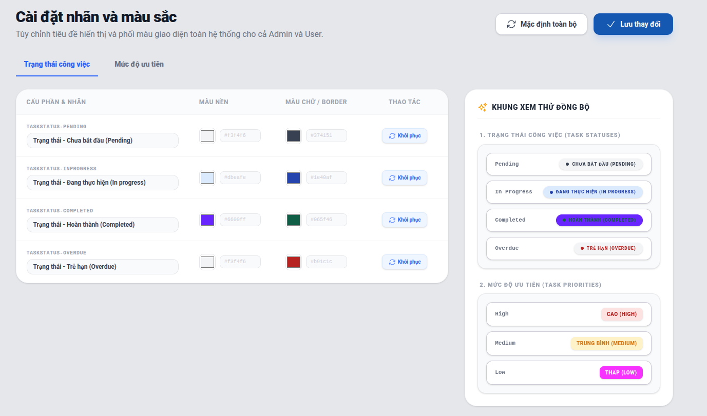

# Custom màu một số component

Để tăng tính cá nhân hóa, hệ thống cho phép quản trị viên sửa đổi màu sắc của một số component như nhãn trạng thái đăng ký lịch làm tại trang lịch tổng quát nhân viên, hay nhãn cho giờ đăng ký/thực tế . Để sử dụng tính năng này, người dùng click vào biểu tượng bánh răng nằm trên Header. 

## Chọn component

Người dùng có thể chọn một trong số các component sau để chỉnh sửa màu chữ / label có trong component đó.  

### Chỉnh sửa màu
1. Tại component vừa chọn, lựa chọn màu nền hoặc màu chữ của các thành phần tương ứng như hình vẽ. Component sau khi được custom sẽ thể hiện chỉnh sửa tương ứng tại khung xem thử đồng bộ bên phải. 
2. Sau khi chỉnh sửa, bấm lưu thay đổi để cập nhật chỉnh sửa.
3. Nếu muốn quay lại thiết lập ban đầu, bấm `Mặc định toàn bộ` và `Lưu thay đổi`.

