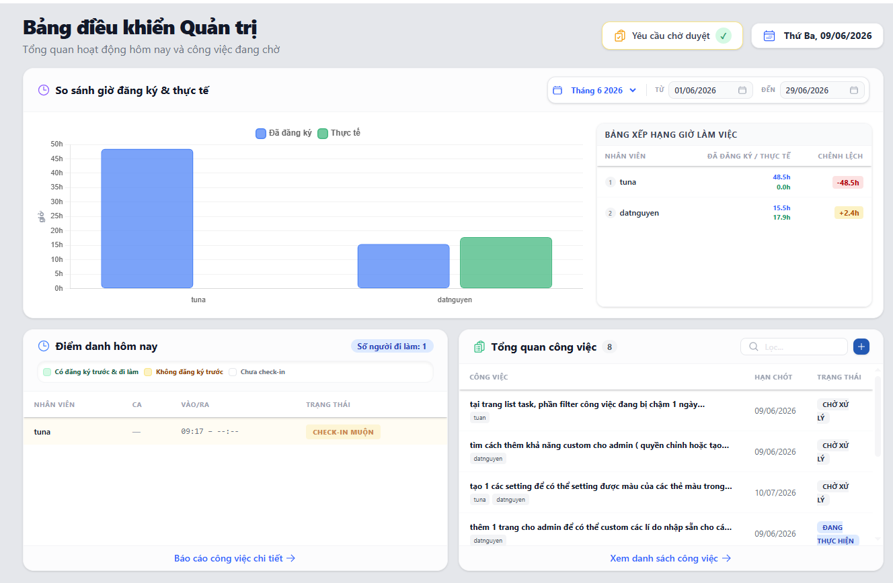

# Bảng điều khiển (Dashboard)

**Dashboard** là giao diện đầu tiên bạn nhìn thấy sau khi đăng nhập thành công vào IMA. Nó đóng vai trò là một trung tâm điều khiển (Control Center) tóm tắt các hoạt động quan trọng nhất.

## Tính năng hiển thị

1. **Thống kê giờ làm (KPA):**
   - So sánh giờ đăng ký với thực tế
   - Bảng xếp hạng giờ làm việc của nhân viên
2. **Thông tin điểm danh:** Thông tin chấm công của nhân viên trong ngày
3. **Tổng quan công việc:** Danh sách nhanh các công việc sắp xếp theo trạng thái (quá hạn, đang chờ,...)

Với Dashboard, Quản lý có thể nhìn lướt qua để biết thực trạng của đội ngũ.

