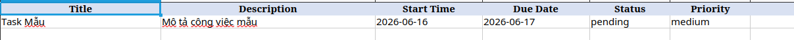
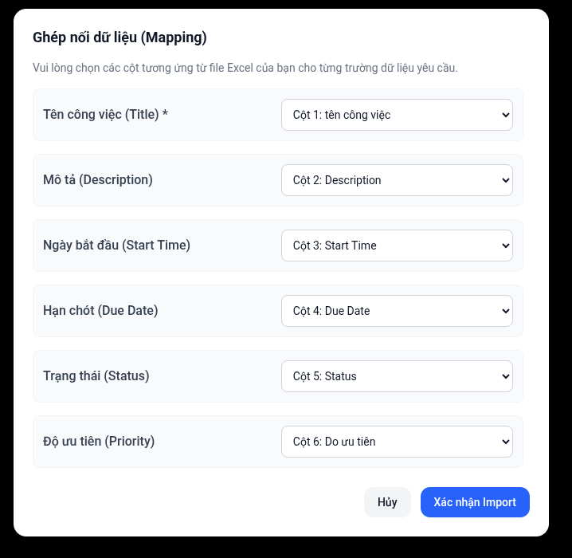

# Import / Export Excel

Để tiết kiệm thời gian, hệ thống IMA hỗ trợ khả năng tải lên hàng loạt công việc bằng file Excel (.xlsx) cũng như tải về để lưu trữ báo cáo.

## Export (Xuất dữ liệu)

Bạn có thể xuất danh sách công việc hiện tại ra file Excel để lưu trữ hoặc gửi báo cáo cho cấp trên.
1. Tại trang danh sách **Tasks**.
2. Nhấn nút **Export**.
3. File `Tasks.xlsx` sẽ được tải xuống tự động.

Trong file tải về, các cột được định dạng rõ ràng:
- `Task ID`, `Title`
- `Assigner` (Tên người giao việc), `Participants` (Tên người tham gia)
- `Status`, `Priority`, `Start Time`, `Due Date`

## Import (Nhập dữ liệu)

Nếu bạn có danh sách hàng chục công việc cần giao, sử dụng Import sẽ nhanh hơn so với việc tạo tay.

### Tải file mẫu (Template)
1. Tại trang danh sách **Tasks**.
2. Nhấn nút **Download Template**.
3. Mở file mẫu lên, bạn sẽ thấy các cột có sẵn (Title, Description, Start Time, Due Date, Status, Priority).

### Điền dữ liệu và Tải lên
1. Điền thông tin công việc vào file Excel (mỗi dòng 1 công việc).
2. Lưu ý:
   - Cột **Status**: Chỉ nhận `pending`, `in progress`, `completed`, `overdue`.
   - Cột **Priority**: Chỉ nhận `low`, `medium`, `high`.
   - Cột **Title** là bắt buộc.
3. Quay lại trang **Tasks**, nhấn **Import** và chọn file của bạn.
4. Hệ thống sẽ hiển thị thông báo chi tiết: Bao nhiêu dòng thành công, bao nhiêu dòng thất bại và chỉ rõ lý do thất bại (nếu có).

