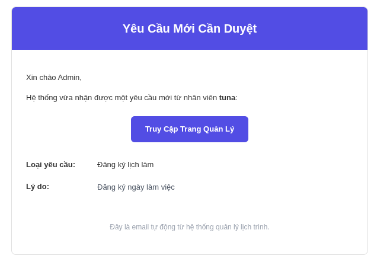

# Thông báo và Email (Notifications)

Hệ thống cung cấp tính năng thông báo song song (Web và qua Email) nhằm đảm bảo người dùng không bỏ lỡ bất kỳ thông tin quan trọng nào.

## Thông báo trên web
- Nằm ở góc trên bên phải màn hình khi có thông báo mới.
- Bấm vào để xem danh sách thông báo. Các thông báo chưa đọc sẽ được in đậm.
- Hệ thống gửi thông báo khi:
  - Có người giao một task mới cho bạn.
  - Sếp (Manager) vừa duyệt/từ chối đơn xin nghỉ phép của bạn.
  - Có bình luận mới trong công việc bạn đang tham gia.

## Email tự động
Bên cạnh thông báo trong ứng dụng, một email chi tiết sẽ được tự động gửi đến hòm thư đã đăng ký của bạn.
Nội dung Email bao gồm:
- Tiêu đề công việc mới.
- Người giao việc.
- Đường link trực tiếp bấm vào là mở được giao diện hệ thống.

*Lưu ý: Để tính năng này hoạt động, lập trình viên cần đảm bảo đã cấu hình thông tin SMTP (`EMAIL_USER`, `EMAIL_PASS`) trong phần biến môi trường. Người dùng cần kiểm tra thư trong mục spam và không chặn email từ hệ thống*

