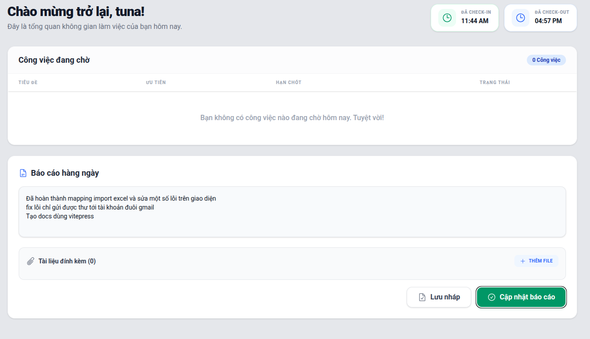

# Báo cáo hàng ngày (Daily Reports)

Tính năng **Reports** giúp thực tập sinh nộp báo cáo tổng hợp tiến độ công việc vào cuối ngày và giúp quản lý đánh giá hiệu suất.

## Nộp báo cáo mới
- Ở menu trái, chọn **Reports**.
- Nhấn **Nộp báo cáo mới**.
- Nhập tóm tắt công việc đã làm trong ngày, các khó khăn gặp phải và đề xuất.
- Kèm theo file đính kèm nếu cần thiết (ảnh chụp màn hình, file doc...).

## Đánh giá báo cáo
Người quản lý có thể xem tất cả báo cáo được nộp trong ngày.
- Mở chi tiết báo cáo.
- Xem tài liệu đính kèm.
- Chấm điểm hoặc để lại bình luận nhận xét để thực tập sinh cải thiện trong ngày tiếp theo.

