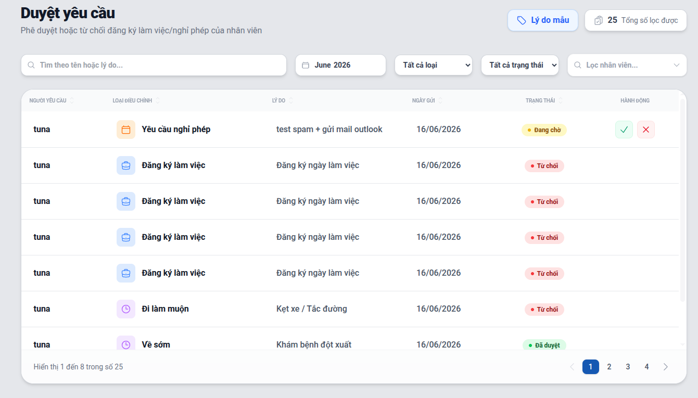
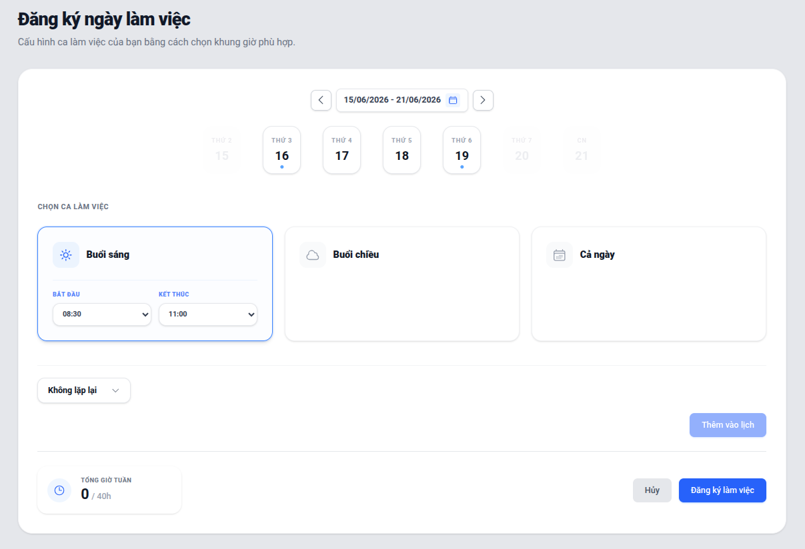

# Quản lý Yêu cầu (Requests)

Hệ thống cho phép người dùng nộp các đơn yêu cầu trực tuyến thay vì dùng giấy tờ, giúp quy trình minh bạch và nhanh chóng hơn.

## Các loại yêu cầu phổ biến
- **Xin nghỉ phép:** (Nghỉ ốm, nghỉ việc riêng). Yêu cầu chỉ định số ngày nghỉ.
- **Đề xuất thiết bị:** Xin cấp phát máy tính, chuột, bàn phím, v.v.

## Nộp Yêu cầu
1. Vào tab **Requests**.
2. Nhấn **Tạo Yêu cầu mới**.
3. Điền loại yêu cầu, lý do chi tiết và thời gian mong muốn.
4. Gửi yêu cầu. Hệ thống sẽ báo tin cho Quản lý.

## Quy trình Duyệt
Quản lý sẽ nhận được thông báo:
- Vào danh sách các yêu cầu đang chờ (Pending).
- Xem xét lý do.
- Nhấn **Phê duyệt** (Approve) hoặc **Từ chối** (Reject).
- Nếu từ chối, Quản lý có thể để lại ghi chú lý do. Hệ thống sẽ phản hồi lại cho người tạo đơn.

